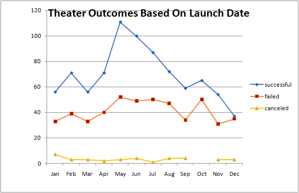
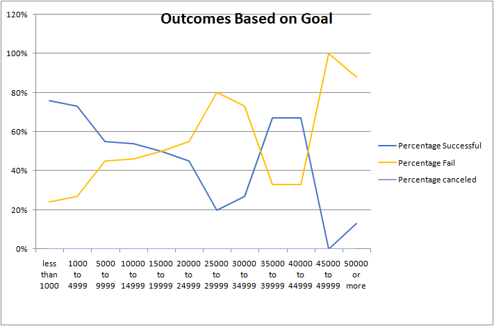
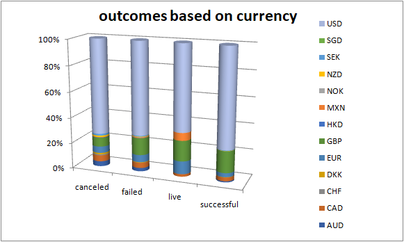

# kickstarter_analysis
perform analysis on kickstarter

# Kickstarting with Excel

## Overview of Project
  **kickstarter_challanges** project contains large amount of data set in excelsheet so we has to perform different kind of function and fillters and validations for this project which is very usefull to understand how the excel works as well as how we can use excel for our different needs. This project is very usefull to summerize and learning excel from basic to advance.
  -This project covered every mendatory functions of excel which is very important for the strong start of this Bootcamp activities.
  -From this project we learn from **cell formating to filltering data with the use of different functions like sum(),count(),round(),average(),if(),countifs(),and so on.**
  - there are 21 column and around 4200 rows and from using that data we create pivote tables and charts which describe the information more clearly and in well mannered form.
  - this project contains 5 charts and pivote tables as well as one reserch table too.

### Purpose
  - The main purpose of this project is to make student used to for the large amount of data set and work on that project with focused mind. 
  - The another purpose is to giving awearness about the excel and their different functionalities and how they can maximum used excel for retriving their result from using that.
  - make student confident about their ability of doing this with confidence.
  - The very important purpose of this project is that how accuratelly they learning the things from the classes and apply in this project.

## Analysis and Challenges

### Analysis of Outcomes Based on Launch Date
   This table and chart shows the outcomes data from the **date created conversion column** which is basically human readable form of **launch date column**in kikstarter_challenge.
   - In this table column are under outcomes category and rows are launch date which is converted into group of months.
   - We can use the filter on parent catgory and year too.
   - We apply the filter on parent category is **theater** so this table called theater outcome based on launchdate.
   - We can found from the tablee that canceled outcomes are below 10 in every months and the maximum canceled outcomes is 7 in january month.
   - The **maximum** number of successful outcomes are in the month of **MAY** and it found **lowest** in the month of **DECEMBER** which are 111 and 37.
   - If we can noticed that the outcomes of **fail** is in between the range of **30 to 55** each month.
   - The **total of outcomes by months** is equal to the **squre root of grand total**.
   - The success number for MAY is the **67%** of total number of outcomes in that month.
   - We can also illustrated from graph that at the middle of the year the outcome is suddenly raised above 110 and then it gradually droped at the end of the year.
   - For the **failed** we didn't notice that sudden changes like successful but it is always fluctuated from starting to the end.
   - Overall the successful outcomes ratio is **more than half in compare with Total number of outcomes". 

**Image:**

### Analysis of Outcomes Based on Goals

This table and chart describes the outcome based on GOALS of PLAYS "subcategory". The goals are differentiate into **5000 ranges from <1000 to >50,000**.
    - first we can see that there are **no canceled PLAYS**.So, outcomes divided into only 2 parts; **Successful and Fail** category.
    - There are only 0 successful and 1 fail outcome shown between the range of 45,000 to 49,999.So the persentage of success is 0 and for fail it displays 100% between this range.
    - Between the goal ranges **35,000 to 39,999 and 40,000 to 44,999** there are same  percentage of successful outcome which is  **67**  there are also repatative number for same ranges of goal coloumn in **fail category which is 33%.**
    - for the **PLAYS** category the **percentage of fails** is more than **6 times **in compare to successful coloumn.**
    - Basically, when the ratio of success is** increase **the ratio of fail is declined and vise versa.** it happens because there are no canceled Plays under subcategory.
    **Image:**
    
    

### Challenges and Difficulties Encountered
  

## Results

-**** What are two conclusions you can draw about the Outcomes based on Launch Date?

## conclution no 1:
     As we can conclude that ratio of successful and failed outcomes are always above the 100,while the ratio of canceled and live outcomes are always below the 50 in every months. As well as there is live outcomes visible for january,fabruary and march..after march there is no live outcomes are visible.

## conclution no 2:
    In the Grand total column it can be easily shown that ratio is always between 250 to 400 in every months it can't visible under 250 or below 400. On the other side we can clearly see that more than 50% of outcomes values are under the Successful category and remaining are canceled,failed and live.

- **What can you conclude about the Outcomes based on Goals?**
## conclution:
    This table and chart describes the outcome based on GOALS of PLAYS "subcategory". The goals are differentiate into 5000 ranges from <1000 to >50,000.
    - first we can see that there are no canceled PLAYS.So, outcomes divided into only 2 parts; Successful and Fail category.
    - There are only 0 successful and 1 fail outcome shown between the range of 45,000 to 49,999.So the persentage of success is 0 and for fail it displays 100% between this range.
    - into, percentage of successful outcome coloumn 67% is repetative number for 35,000 to 39,999 and 40,000 to 44,999. there are also repatative number for same ranges of goal coloumn in fail category which is 33%.
    - for the PLAYS category the percentage of fails is more than 6 times in compare to successful coloumn.
    - Basically, when the ratio of success is increase the ratio of fail is declined and vise versa. it happens because there are no canceled Plays under subcategory.

- **What are some limitations of this dataset?**

    

- **What are some other possible tables and/or graphs that we could create?**
I found that one table which is based on currency from which we can found the outcomes and chart from that table too.

## Image ##:

 There is also possible tables from filtering on outcomes values with launch date like "theater outcomes by launchdate" table and chart. for example: food,game,music,so on.

